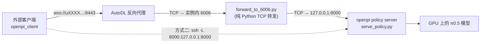

# 在 AutoDL 上部署 openpi 推理服务（对外提供 websocket 接口）

本目录提供在 AutoDL 实例上部署 openpi policy server 并用**外部设备/机器人**调用它的完整方案。
脚本已在当前实例（`NVIDIA vGPU-48GB`，`pi05_robocasa` + `checkpoint/6000`）实测通过。

## 1. 关键约束：AutoDL 没有独立公网 IP

AutoDL 实例只能通过以下两种方式被外部访问，部署方案必须围绕它们设计：

| 方式 | 说明 | 适用场景 |
| --- | --- | --- |
| **AutoDL 自定义服务（6006 / 6008）** | 实例的 `6006`、`6008` 端口被映射到公网地址，形如 `https://uXXXX-xxx.<region>.seetacloud.com:8443`（见环境变量 `AutoDLService6006URL`）。支持 HTTP（含 WebSocket 升级），实测可直接承载 openpi 的 websocket 协议。 | 机器人/其他机器在任意网络，想直接用公网地址连 |
| **SSH 隧道** | `ssh -CNg -L 本地端口:127.0.0.1:实例端口 ...`，任意端口都能代理，且流量加密。 | 客户端是一台 Linux/Mac/Windows 的机器，能 SSH |
| （可选）frp / Nginx 反代 | 如果另有一台公网服务器，可把隧道或 frp 暴露出去 | 有公网跳板机 |

> 注意：控制台「开放端口」需要企业认证；个人用户直接用上面的 **自定义服务 + 6006** 或 **SSH 隧道** 即可。

链路示意：



## 2. 目录内容

| 文件 | 作用 |
| --- | --- |
| `start_server.sh` | 后台启动 policy server（自动生成/复用 API key、写日志、等待就绪、打印外部访问方式） |
| `stop_server.sh` | 停止服务 |
| `forward_to_6006.py` | 把 `6006` 转发到 openpi 端口（AutoDL 镜像没有 socat/nginx，用纯 Python 实现） |
| `test_client.py` | 连通性与推理自检（支持 `ws://` 与 `wss://`） |
| `verify.sh` | 一键验证：进程 → 健康检查 → 6006 转发 → 公网 → 鉴权 → 端到端推理 |

## 3. 步骤一：在实例内启动服务

```bash
cd /root/autodl-tmp/openpi

# 默认：pi05_robocasa + checkpoint/6000，监听 8000，自动生成 API key
bash deploy/autodl/start_server.sh

# 其它用法
bash deploy/autodl/start_server.sh --config pi05_libero \
    --dir gs://openpi-assets/checkpoints/pi05_libero      # 官方 checkpoint
bash deploy/autodl/start_server.sh --port 8000 --api-key my-secret --gpu 0
bash deploy/autodl/stop_server.sh --port 8000             # 停止
```

启动后会打印：

```
✅ 服务已就绪
   本地:      ws://127.0.0.1:8000   (健康检查 http://127.0.0.1:8000/healthz)
   API key:   <自动生成的 32 位密钥，保存在 logs/api_key>
   AutoDL 自定义服务(6006) 公网地址: wss://uXXXX-xxx.bjb1.seetacloud.com:8443
```

日志在 `logs/serve_<port>.log`，可用 `tail -f logs/serve_8000.log` 观察。

回退到“手动命令”也等价于：

```bash
XLA_PYTHON_CLIENT_PREALLOCATE=false .venv/bin/python scripts/serve_policy.py \
    --port=8000 --api-key="$(cat logs/api_key)" \
    policy:checkpoint --policy.config=pi05_robocasa --policy.dir=checkpoint/6000
```

> `XLA_PYTHON_CLIENT_PREALLOCATE=false` 避免 JAX 预占全部显存，推理服务建议保持。

## 4. 步骤二：让外部能访问

### 方式 A：AutoDL 自定义服务 6006（公网地址，推荐）

```bash
cd /root/autodl-tmp/openpi
# 把 6006 转发到 openpi 的 8000（后台运行）
nohup .venv/bin/python deploy/autodl/forward_to_6006.py --target-port 8000 \
    > logs/forward_6006.log 2>&1 &
```

然后在**任意一台外部机器**上：

```bash
# 健康检查（应返回 200 OK）
curl https://uXXXX-xxx.<region>.seetacloud.com:8443/healthz

# 客户端地址就是（把 https 换成 wss）
# wss://uXXXX-xxx.<region>.seetacloud.com:8443
```

公网地址可从实例环境变量取得：`echo $AutoDLService6006URL`（去掉 `https://` 前缀即为主机+端口）。

### 方式 B：SSH 隧道（无需开放端口，流量加密）

在**你自己的电脑**上执行（地址/端口用控制台里该实例的 SSH 指令）：

```bash
ssh -CNg -L 8000:127.0.0.1:8000 root@region-1.autodl.com -p 42151
```

之后在本地代码里连接 `ws://127.0.0.1:8000` 即可（Windows 图形工具：AutoDL-SSH-Tools）。

### 公网地址是否固定？

当前实例的映射关系是：

```
AutoDLContainerUUID = a88f4a8a56-add951a7   （实例容器 UUID）
AutoDLRegion        = bj-B1                 （区域）
AutoDLService6006URL= https://u1119227-8a56-add951a7.bjb1.seetacloud.com:8443
                                  └用户ID┘ └─实例UUID后段─┘ └区域┘
```

即地址由「用户 ID + 实例容器 UUID + 区域」派生（`u1119227` 是账号前缀，`a56-add951a7` 来自实例 UUID，`bjb1` 是北京 B1 区）：

| 场景 | 地址是否变化 | 说明 |
| --- | --- | --- |
| 同一实例正常关机 → 再开机 | **不变** | 地址派生自实例容器 UUID，开关机不改变 UUID；重新运行 `start_server.sh` + `forward_to_6006.py` 即可 |
| 实例关机期间 | 地址不变但**不可用** | 实例不运行就没有服务在 6006 上监听 |
| 重置系统 / 删除后重建实例 | **会变** | 会分配新的容器 UUID |
| 跨地区迁移、升降配置后重建实例 | **会变** | 区域代码或 UUID 变了（如 `bjb1` → `nmb2`） |
| 按量计费 → 包年包月 | 不变 | 还是同一个实例 |

因此**不要把地址硬编码进机器人代码**：把它当参数/环境变量传入（`client_remote.sh --host wss://... --port 8443`），
或在客户端侧动态读取服务端公开的信息。

如果业务上必须有一个**长期固定**的入口，可选：

1. **frp / Nginx 反代 + 一台固定公网服务器**：实例内跑 `frpc` 主动连到你的服务器，对外暴露固定域名/IP；
   实例迁移换地址也不影响客户端（只改 frpc 配置）。这是最稳的方案。
2. **Cloudflare Tunnel（cloudflared）**：绑定自己的域名后同样是固定域名（临时 `trycloudflare` 域名不固定）。
3. 固定不了时至少做到"可发现"：把地址与 key 写在实例内固定路径（如 `logs/`）由脚本读取，机器人侧只配置一次相对路径。

## 5. 步骤三：外部客户端调用

机器人 / 评估机侧只需 `openpi-client`（依赖很轻）：

```bash
cd /path/to/openpi/packages/openpi-client && pip install -e .
```

```python
from openpi_client import image_tools, websocket_client_policy

# 方式 A（公网）: host 传完整 wss 地址；方式 B（SSH 隧道）: host="127.0.0.1", port=8000
client = websocket_client_policy.WebsocketClientPolicy(
    host="wss://uXXXX-xxx.bjb1.seetacloud.com:8443",
    api_key="<logs/api_key 里的密钥>",
)
# 或 client = websocket_client_policy.WebsocketClientPolicy(host="127.0.0.1", port=8000, api_key=...)

observation = {
    "observation/image": image_tools.convert_to_uint8(image_tools.resize_with_pad(img, 224, 224)),
    "observation/wrist_image": image_tools.convert_to_uint8(image_tools.resize_with_pad(wrist_img, 224, 224)),
    "observation/state": state,          # 未归一化的 state，服务端会做归一化
    "prompt": "close the drawer",
}
actions = client.infer(observation)["actions"]   # (action_horizon, action_dim)，如 (50, 12)
```

> 观测的键名必须与服务端 config 的 policy 输入一致：
> `robocasa` → `observation/image`、`observation/wrist_image`、`observation/right_image`、`observation/state`、`prompt`；
> `libero` → `observation/image`、`observation/wrist_image`、`observation/state`；
> `droid` → `observation/exterior_image_1_left`、`observation/wrist_image_left`、`observation/joint_position`、`observation/gripper_position`。

实例内自测（会做 `--preset` 对应的键映射）：

```bash
KEY=$(cat logs/api_key)
.venv/bin/python deploy/autodl/test_client.py --host 127.0.0.1 --port 8000 --api-key "$KEY"
.venv/bin/python deploy/autodl/test_client.py --uri wss://uXXXX-xxx.bjb1.seetacloud.com:8443 --api-key "$KEY"
```

### 一键验证（推荐先跑这个）

```bash
bash deploy/autodl/verify.sh                 # 全量验证，含一次真实推理
bash deploy/autodl/verify.sh --skip-inference # 只查连通性，不触发模型推理
```

输出示例（本实例实测）：

```
== 1. 服务进程 ==            ✅ policy server 正在运行 (PID: 28499)
== 2. 本地健康检查 ==        ✅ http://127.0.0.1:8000/healthz → HTTP 200
== 3. 6006 转发 ==           ✅ http://127.0.0.1:6006/healthz → HTTP 200
== 4. 公网地址 ==            ✅ https://u1119227-...:8443/healthz → HTTP 200
== 5. 鉴权 ==                ✅ 错误 API key 被拒绝（401）
== 6. 端到端推理 ==          ✅ 实例内推理成功；✅ 公网推理成功（往返 115.9ms）
验证结果：7 项通过，0 项失败
```

### 接 robocasa 仿真评估

`examples/robocasa/main.py` 用的是 `tyro.cli(eval_robocasa)`，**参数需要 `--args.` 前缀**，布尔开关用 `--args.no-xxx`。
仓库根目录提供两个启动脚本：`client.sh`（原始脚本，不带鉴权）与 `client_remote.sh`（推荐：自动读取
`logs/api_key`，并可直接用 `--host/--port` 指向远端服务）。

```bash
# 推荐：client_remote.sh，自动带 API key，连本机 127.0.0.1:8000
bash client_remote.sh --args.num_envs 1 --args.num_trials_per_task 1 --args.max_steps 60 --args.no-save-video

# 直连公网服务（--host 带 wss:// 前缀，端口用 --port 单独指定）
bash client_remote.sh --host wss://uXXXX-xxx.bjb1.seetacloud.com --port 8443 \
    --args.num_envs 1 --args.num_trials_per_task 1 --args.max_steps 60 --args.no-save-video

# 也可以用原始脚本 / 直接调 main.py（服务端启用鉴权时必须自己传 key）
bash client.sh --args.api-key "$(cat logs/api_key)"
python examples/robocasa/main.py \
    --args.host wss://uXXXX-xxx.bjb1.seetacloud.com --args.port 8443 --args.api-key "$KEY"
```

> 客户端拼接规则是：`host` 以 `ws` 开头则原样使用（支持 `wss://`），否则补 `ws://`，最后再拼 `:port`；因此公网地址要写成 `--args.host wss://uXXX...seetacloud.com --args.port 8443`。
> 两个脚本都会自动激活 robocasa 仿真环境：`Isaac-GR00T/gr00t/eval/sim/robocasa/robocasa_uv/.venv`。

## 6. 安全

- 服务端现在支持 `--api-key`（客户端通过 `Authorization: Api-Key <key>` 发送，见 `WebsocketClientPolicy(api_key=...)`）。
  一旦把 8000/6006 暴露到公网，**务必启用**；`start_server.sh` 在没有指定时也会自动生成一个并写入 `logs/api_key`。
- 健康检查 `/healthz` 不需要鉴权，方便探活。
- 公网地址等于"任何人拿到地址就能跑推理"，请在泄露后及时更换 key（删除 `logs/api_key` 后重启）。

## 7. 运维与常见问题

- **客户端报 `HTTP 401`**：服务端启用了 API key，客户端必须传 key（`client_remote.sh` 会自动读取 `logs/api_key`；用原始 `client.sh` 或裸调 `examples/robocasa/main.py` 需自己加 `--args.api-key`）。
- **`tyro` 参数报 Unrecognized**：`examples/robocasa/main.py` 的参数都要加 `--args.` 前缀（如 `--args.port`），布尔开关写成 `--args.no-save-video`。
- **实例重启后服务不会自动拉起**：重新执行 `start_server.sh`；或用 `screen`/`tmux` 保活，AutoDL 也提供「守护进程(开后台)」功能。
- **首次推理慢**：第一次调用会触发 JAX JIT 编译（本实例实测 27.8s），之后稳定在 ~0.1s；可以先用 `test_client.py` 预热一次再接入机器人。
- **显存/并发**：服务端会串行化 `infer`（policy 内部的 PRNG 非线程安全），多客户端并发时延迟会叠加，建议一次只跑一个客户端。训练和 serve 不要同时占用同一张卡。
- **断线**：`WebsocketClientPolicy` 仅在"连接被拒"时重试；连接建立后若因网络中断掉线，需在机器人侧 `try/except` 重建 client。
- **延迟与带宽**：单步观测含 3 张 224×224 图像（uint8，约 450 KB），公网建议在客户端先 `resize_with_pad` 再发送；本实例经 6006 公网代理实测往返约 112 ms（含推理 ~105 ms）。
- **6006 被占用**：`forward_to_6006.py` 启动会报 `Address already in use`，先 `pkill -f forward_to_6006` 或改用 `--listen-port 6008`。
- **端口不通排查**：`curl http://127.0.0.1:8000/healthz`（服务本身）→ `curl http://127.0.0.1:6006/healthz`（转发）→ `curl https://<公网地址>/healthz`（代理），三级依次排查。

## 8. 本次实测记录（2026-09-15，本实例）

| 项目 | 结果 |
| --- | --- |
| 环境 | `uv 0.12.6`、`.venv`（Python 3.11）、JAX 0.5.3、`NVIDIA vGPU-48GB` |
| 加载 checkpoint | `checkpoint/6000`（`pi05_robocasa`），orbax 恢复 10s |
| 实例内 `ws://127.0.0.1:8000` | 首帧 27.9s（JIT），后续 104 ms，`actions.shape=(50, 12)` |
| 公网 `wss://u1119227-...:8443`（经 6006 代理） | 112 ms，动作 chunk 正常 |
| 鉴权 | 无 key / 错误 key → HTTP 401；正确 key → 正常；未配置 key 时允许匿名 |
| `verify.sh` | 7 项检查全部通过 |
| robocasa 仿真闭环（`client_remote.sh`，60 步，1 episode） | 本机 27.2s / 公网 wss 18.9s，观测经 websocket 送到服务端并回传动作，无报错 |
