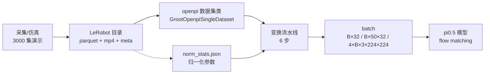
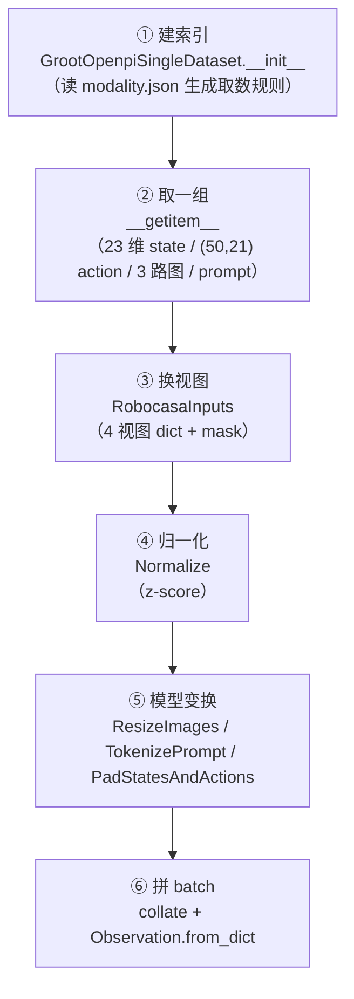

# LeRobot × openpi 数据处理流水线（20 分钟分享材料）

> **一句话主题**：把机器人演示数据从「一堆 mp4 + parquet」变成「模型能吃的 batch」，中间到底发生了什么。
> **数据实例**：`dataset/single_panda_gripper.CloseDrawer`（3000 集关抽屉演示，Panda + 移动底座）
> **代码实例**：`pi05_close_drawer_tianpeng_demo`（openpi，pi0.5 + LoRA 微调）
> **所有数字均为本仓库实测**，可现场复现（见第 10 页演示脚本）。

---

## 时间分配（总计 ≈ 20 分钟）

| 页 | 内容 | 时长 | 备注 |
|---|---|---|---|
| 1 | 开场：为什么讲数据流水线 | 1 min | |
| 2 | 全景：LeRobot 管「存」，openpi 管「喂」 | 2.5 min | 含目录结构 |
| 3 | 数据有什么：meta 四件套 + 规模 | 2 min | 超时可压缩 |
| 4 | 数据长什么样：一帧解剖（state/action/图像/语言） | 4 min | **重点页** |
| 5 | 三个容易踩的坑：视频帧数、时间戳、伪指令 | 2 min | |
| 6 | 流水线总览：六步变换 | 2 min | 只讲图 |
| 7 | 取数规则与拼接对齐（53→23、12→21） | 3 min | **重点页** |
| 8 | 归一化 + 模型变换（tokenize 格式） | 3 min | |
| 9 | 输出的东西都是什么：batch 逐项 + 训练/推理产物 | 2.5 min | **重点页** |
| 10 | 现场演示 + 总结 + 坑清单 | 1 min | |

> 若现场提问多，优先保 4、7、9 三页；第 3 页可一句话带过（细节移到附录 A）。

---

## 第 1 页 · 开场：为什么讲数据流水线

**讲稿要点**

- 模型训练出问题，90% 的时候不是网络结构的问题，是「喂进去的东西不对」。
- 大家平时写代码看到的是 `batch`，看不到的是 batch 之前有 **6 层变换、3 种数据格式（LeRobot 目录 → numpy 字典 → 模型 Observation）**。
- 今天只回答三个问题：**数据有什么？长什么样？最后喂给模型的是什么？**
- 全程用我们真实在训的「关抽屉」数据集和配置，不讲抽象概念。

---

## 第 2 页 · 全景：LeRobot 管「存」，openpi 管「喂」

**角色分工**

| 角色 | 干什么 | 在我们这儿的体现 |
|---|---|---|
| **LeRobot** | 定义数据的「存储标准」：目录结构、parquet+mp4、meta 元数据 | 数据集是标准 LeRobot v2.0 目录（带 GR00T 风格扩展） |
| **openpi** | 定义数据的「消费标准」：读什么、怎么变换、batch 长什么样 | `GrootOpenpiSingleDataset` + `RobocasaInputs` + 4 个变换 |



**目录结构（真实）**

```
dataset/single_panda_gripper.CloseDrawer/
├── meta/
│   ├── info.json        # 数据集身份证：规模、fps、每个特征的名字和形状
│   ├── episodes.jsonl   # 每集一行：长度、包含哪些任务、轨迹 id
│   ├── tasks.jsonl      # 任务字典：task_index → 指令文本（4 条）
│   ├── stats.json       # 原始数据统计量（mean/std/q01/q99）
│   └── modality.json    # ★ GR00T 扩展：把「53 维大数组」切成命名片段
├── data/chunk-000/episode_000000.parquet   # 每一帧的状态与动作
└── videos/chunk-000/observation.images.{left_view,right_view,wrist_view}/episode_000000.mp4
```

---

## 第 3 页 · 数据有什么

**规模（来自 `meta/info.json`，实测核对）**

| 项目 | 数值 |
|---|---|
| 机器人 | Panda + OmronBase（7 轴臂 + 移动底座 + 夹爪） |
| episode 数 | **3000**（3 个 chunk × 1000） |
| 总帧数 | **619,411** 帧 |
| 采样率 | **20 fps**（相邻帧 0.05 s） |
| 单集长度 | min 152 / 平均 206.5 / max 268 帧 |
| 相机 | 3 路：left_view、right_view、wrist_view（256×256×3） |
| 视频文件 | 3000 集 × 3 视角 = **9000 个 mp4** |
| 语言指令 | 4 条（其中 **2 条是真实指令**，见第 5 页） |
| 磁盘 | parquet 364 MB + 视频 8.7 GB ≈ **9 GB** |

**一句话**：这是一份「**8.6 小时**（61.9 万帧 ÷ 20 fps）、纯仿真、两条指令」的可训练数据集；拿到它的人不需要原始采集系统，光看这 4 个 meta 文件就能完整理解数据。

---

## 第 4 页 · 数据长什么样（重点页）

### 4.1 一帧 = 一份 parquet 行 + 3 张图

以第 0 集为例（`episode_000000.parquet`：**199 行 × 11 列**）：

| 列 | 形状 | 内容 |
|---|---|---|
| `observation.state` | float64[53] | 机器人全身状态（下一节拆解） |
| `action` | float64[12] | 这一帧执行的动作（下一节拆解） |
| `timestamp` | float64 | 0.0 / 0.05 / 0.1 … |
| `annotation.human.action.task_description` | int64 | **任务索引**（0 或 3），不是文本 |
| `annotation.human.action.task_name` / `.validity` | int64 | 元数据标签（1 / 2），**不是指令** |
| `task_index` | int64 | 与 task_description 一致 |
| `episode_index` / `index` / `next.reward` / `next.done` | — | 定位与 RL 用的元信息 |

真实数值片段：

```
observation.state @t=0 前 12 维: [4.17, -3.2492, 0.7, 0.0, 0.0, -0.0, 1.0, 4.4041, -3.2757, 1.2846, 0.2341, -0.0266]
action          @t=0 前 12 维: [0.0, 0.0, 0.0, 0.0, 0.0, -0.0028, -0.0394, 0.0034, -0.0519, -0.0132, 0.0269, 0.0]
```

### 4.2 state 53 维怎么读（`modality.json` 切片表）

| 片段 | 索引 | 维度 | 说明 |
|---|---|---|---|
| base_position | 0:3 | 3 | 底座位置 |
| base_rotation | 3:7 | 4 | 底座四元数 |
| end_effector_position_absolute | 7:10 | 3 | 末端位置（绝对） |
| **end_effector_position_relative** | 10:13 | 3 | 末端位置（相对，训练用） |
| end_effector_rotation_absolute | 13:17 | 4 | 末端四元数（绝对） |
| **end_effector_rotation_relative** | 17:21 | 4 | 末端四元数（相对，训练用） |
| **gripper_qpos** | 21:23 | 2 | 夹爪开合 |
| gripper_qvel | 23:25 | 2 | 夹爪速度（训练时借给 action，见第 7 页） |
| **joint_position** | 25:32 | 7 | 7 个关节角 |
| joint_position_cos / sin | 32:46 | 14 | 关节角三角编码 |
| joint_velocity | 46:53 | 7 | 关节速度（训练时借给 action） |

### 4.3 action 12 维怎么读

| 片段 | 索引 | 维度 | 说明 |
|---|---|---|---|
| base_motion | 0:4 | 4 | 底盘运动（相对量） |
| control_mode | 4 | 1 | 控制模式（整型 0/1） |
| end_effector_position | 5:8 | 3 | 末端位置增量 |
| end_effector_rotation | 8:11 | 3 | 末端旋转增量（轴角） |
| gripper_close | 11 | 1 | 夹爪指令（整型 0/1） |

**讲稿要点**：53 维里其实混了绝对量和相对量、位置和旋转，还有 cos/sin 这种冗余编码——这是 GR00T 系数据集的典型风格，直接喂给 pi0.5 会「维度对不上 + 语义混乱」，所以后面必须做**挑选和重排**。

---

## 第 5 页 · 三个容易踩的坑

**坑 1：视频帧数 ≠ parquet 行数**

- 第 0 集：parquet **199 行**，每个 mp4 **209 帧**（多 10 帧）。
- 原因：视频编码按时间轴存，末尾多出静止帧。
- 处理方式：**不信帧号，只信 timestamp**——代码用 parquet 的 `timestamp` 去视频里取帧
  （`get_frames_by_timestamps`，opencv 后端）。
- 后果：如果谁手动「按索引对齐」，数据会整体错位 0.5 秒。

**坑 2：指令藏在索引里**

- parquet 里 `task_description` 是**整数**（0 或 3），要拿 `tasks.jsonl` 才能翻译成文本。
- 本数据集 4 条 task 中，**只有 2 条是真实指令**：

| task_index | 文本 | 真实语义 |
|---|---|---|
| 0 | `close the left drawer` | ✅ 指令（1604 集） |
| 1 | `CloseDrawer` | ❌ 任务名标签 |
| 2 | `Valid` | ❌ 有效性标签 |
| 3 | `close the right drawer` | ✅ 指令（1396 集） |

- 如果误把 `CloseDrawer`/`Valid` 当 prompt，模型会学到一半数据「指令都是废话」，语言条件失效。

**坑 3：episode 边界不跨界**

- 训练时每条样本要取 **未来 50 步动作**；到了 episode 末尾不够 50 步怎么办？
- 代码做法：索引 `clamp` 到本集最后一帧——绝对量重复末帧、相对量补 0，**绝不跨到下一集**。
- 换句话说：**一个训练样本永远只属于一条轨迹**。

---

## 第 6 页 · 流水线总览：六步变换



代码锚点（`src/openpi/training/data_loader.py::transform_dataset` 的变换顺序）：

```python
repack_transforms.inputs      # 我们这条链路为空
data_transforms.inputs        # RobocasaInputs：换视图
Normalize(norm_stats)         # 归一化
model_transforms.inputs       # InjectDefaultPrompt(空) → ResizeImages(224) → TokenizePrompt(112) → PadStatesAndActions(32)
```

---

## 第 7 页 · 取数规则与拼接对齐（重点页）

### 7.1 取数规则来自 `modality.json`

| 模态 | 取哪些时间步 | 结果 |
|---|---|---|
| video | `[0]` | 当前帧 3 路图 |
| state | `[0..49]` | (50, 53)；实际只取第 0 步当观测 |
| action | `[0..49]` | (50, 12) → 展开成 (50, 21) |
| language | `[0]` | 指令文本 |

> 「从第 0 步取到第 49 步」= **action chunk（动作块）**：模型一次预测未来 2.5 秒（50 帧 ÷ 20 fps）的动作。

### 7.2 53 维 → 23 维：只留能对齐部署的字段

```
state(23) = ee_pos_rel(3) + ee_rot_rel(4) + base_pos(3) + base_rot(4) + gripper_qpos(2) + joint_position(7)
```

### 7.3 12 维 → 21 维：**借 state 的维度**补全动作语义

```
action(21) = ee_pos(3) + ee_rot(3) + gripper_close(1) + base_motion(4) + control_mode(1)
           + state.joint_velocity(7) + state.gripper_qvel(2)
             └───────────── 从 state 里「借」来的两段 ─────────────┘
```

**为什么要借？** 数据集只存了 12 维「指令型」动作，但底盘/关节的真实运动需要速度信息才能学准。
GR00T 格式里正好有 `joint_velocity`、`gripper_qvel` 存在 state 里，openpi 侧就把它们**按时间轴对齐后拼进 action**，
凑成 21 维的「完整动作向量」。（`src/openpi/training/groot_openpi_dataset.py`）

**讲稿金句**：这一步没有改数据本身，而是**改变了数据的「表达」**——把「控制器指令」翻译成「模型要预测的运动量」。

---

## 第 8 页 · 归一化 + 模型变换

### 8.1 Normalize：z-score，用 32 维统计量裁到实际维度

$$\hat{x} = \frac{x - \mu}{\sigma + 10^{-6}}$$

- 统计量（`checkpoint/6000/assets/norm_stats.json`）：`state.mean/std`、`actions.mean/std`，各 **32 维**（与模型 `action_dim=32` 一致，多出来的 9 维是补位）。
- 归一化时会**自动裁到当前维度**（state 只取前 23 个统计量），所以「统计量 32 维、数据 23 维」不会报错。
- 实测效果：state 从 `[-3.25, +4.17]` 压到 `[-2.10, +1.13]`。
- 推理时反向操作：`Unnormalize` 把模型输出还原成物理量纲。

### 8.2 模型变换三连

| 变换 | 作用 | 实测结果 |
|---|---|---|
| `ResizeImages(224,224)` | 256×256 → 224×224（含 resize_with_pad，保持长宽比） | 4×(224,224,3) uint8 |
| `TokenizePrompt(112)` | 文本 → token id | (112,) int64，有效 ~91–94 个 |
| `PadStatesAndActions(32)` | state 23→32、action 21→32 零填充 | (32,) / (50,32) |

**pi05 的关键差异（必讲）**：pi0.5 把 state **离散化成 256 个整数桶，拼进文本**，而不是当连续输入：

```
"Task: close the left drawer, State: 187 4 250 128 …;\nAction: "
 └──── 语言指令 ────┘  └──── 23 维 state 的整数编码 ────┘
```

> 后果：**归一化必须在分词之前**（否则桶号没意义）；这也解释了为什么配置里 `discrete_state_input=True`。

---

## 第 9 页 · 输出的东西都是什么（重点页）

### 9.1 训练 batch（B=4 实测）

| 字段 | 形状 | 含义 |
|---|---|---|
| `obs.images['base_0_rgb']` | (4, 3, 224, 224) float32 | 左视角，**[-1,1]**（uint8 由 `Observation.from_dict` 转换） |
| `obs.images['base_1_rgb']` | (4, 3, 224, 224) float32 | 右视角 |
| `obs.images['left_wrist_0_rgb']` | (4, 3, 224, 224) float32 | 腕部视角 |
| `obs.images['right_wrist_0_rgb']` | (4, 3, 224, 224) float32 | **补零占位**，`image_mask=False` |
| `obs.image_masks[...]` | (4,) bool | 该视图是否有效 |
| `obs.state` | (4, 32) float64 | 已归一化；23 之后是补位 0 |
| `obs.tokenized_prompt` | (4, 112) int64 | 含 state 整数串的文本 token |
| `obs.tokenized_prompt_mask` | (4, 112) bool | 有效 token 掩码（其余为 padding） |
| `actions` | (4, 50, 32) float64 | **监督信号**：未来 50 步 × 32 维（21 之后补 0） |
| `source` | (4,) int32 | 数据来源 id（多数据集混采时区分来源） |

**逐项对照记忆法**：

```
batch 里每一个东西 = 模型的一个「输入」或「监督」
  输入：4 张图(+mask) + state + token
  监督：actions(50 步动作块)     ← flow matching 的学习目标
  溯源：source
```

### 9.2 流到模型之后还会发生什么

- **训练时**：非腕部视角会做数据增强（随机裁剪 95%、缩放、±5° 旋转、颜色抖动），腕部视角只做颜色抖动。
- **归一化后的 state 进入文本**，图像以 patch 形式进视觉塔，action 作为 flow matching 目标——这里是训练脚本的事，今天不展开。

### 9.3 训练/推理的「输出物」

| 产物 | 位置 | 说明 |
|---|---|---|
| 训练 checkpoint | `./checkpoints/pi05_close_drawer_tianpeng_demo/<exp>/` | orbax 格式，含 params + train_state |
| 归一化参数 | `<checkpoint>/assets/norm_stats.json` | 随 checkpoint 保存，推理必须用同一份 |
| 推理输出 | `RobocasaOutputs` | 取前 **12 维** → (B, 50, 12)，再 `Unnormalize` 回物理量纲 |
| 服务接口 | `scripts/serve_policy.py` + `openpi-client` | websocket，机器人端只需发图/状态、收动作块 |

**闭环一句话**：**数据集的 12 维 action → 归一化 → 训练时 32 维补齐 → 推理时裁回 12 维 → 机器人执行**，维度从哪来、回哪去，全程可追溯。

---

## 第 10 页 · 现场演示 + 总结

**演示命令（30 秒，六步全跑通）**

```bash
cd /root/autodl-tmp/openpi
.venv/bin/python scripts/demo_data_pipeline.py --batch 4 --dump-frames /tmp/demo_frames.png
```

输出会依次打印：数据集概览 → 原始一帧 → 4 视图 → 归一化前后 → token → 最终 batch；
`/tmp/demo_frames.png` 是「左 | 右 | 腕」三视角拼图，可直接贴 PPT。

**总结（背下来）**

1. **数据有什么**：3000 集 / 62 万帧 / 20 fps / 3 视角 / 2 条指令，LeRobot 目录 + GR00T 元数据。
2. **数据长什么样**：一帧 = 53 维 state + 12 维 action + 3 张 256² 图 + 1 条指令（藏在索引里）。
3. **输出是什么**：B×32 状态、B×50×32 动作块、4×B×3×224² 图像、B×112 token——每一项都有明确语义和来源。

**坑清单（送给大家）**

| # | 坑 | 对策 |
|---|---|---|
| 1 | `num_workers>0` 从 stdin 跑会 spawn 失败 | 用真实脚本文件跑（如 `scripts/train.py`） |
| 2 | 视频帧数比 parquet 多 10 帧 | 按 timestamp 取帧，不要按索引 |
| 3 | `task_name`/`validity` 会被误当指令 | 只认 `task_description` 列 + `tasks.jsonl` |
| 4 | norm stats 维度不对 | 用 checkpoint 里的 `assets/norm_stats.json`（32 维） |
| 5 | 内置 `pi05_robocasa*` 配置依赖 `HF_LEROBOT_HOME` | 自定义配置用**绝对路径** `data_dirs` |
| 6 | 磁盘 | 数据 9 GB + 单 checkpoint 12 GB，训练前先挪走旧 ckpt |

---

## 附录 A · 完整字段速查卡

```
一帧（parquet 行）
├─ observation.state: float64[53]
│   0:3 base_position            3:7 base_rotation(quat)
│   7:10 ee_pos_abs             10:13 ee_pos_rel        ← 训练用
│  13:17 ee_rot_abs(quat)       17:21 ee_rot_rel(quat)  ← 训练用
│  21:23 gripper_qpos           23:25 gripper_qvel      ← 借给 action
│  25:32 joint_position(7)      32:39 joint_cos  39:46 joint_sin
│  46:53 joint_velocity(7)                              ← 借给 action
├─ action: float64[12]
│   0:4 base_motion   4 control_mode   5:8 ee_pos   8:11 ee_rot(axis_angle)   11 gripper_close
├─ timestamp / episode_index / index / task_index / next.reward / next.done
└─ annotation.human.{action.task_description | action.task_name | validity}

训练样本（dataset[i]）
├─ observation/state: (23,)
├─ actions: (50, 21)
├─ observation/{image,right_image,wrist_image}: (256,256,3) uint8
├─ prompt: str
└─ source: int32

batch（B）
├─ obs.images: 4 × (B,3,224,224) float32 ∈ [-1,1]
├─ obs.image_masks: 4 × (B,) bool
├─ obs.state: (B,32) float64
├─ obs.tokenized_prompt(+mask): (B,112) int64/bool
├─ actions: (B,50,32) float64
└─ source: (B,) int32
```

## 附录 B · Q&A 预案

| 提问 | 回答要点 |
|---|---|
| 为什么 state 要减到 23 维，不能直接喂 53 维？ | 53 维里含重复编码（cos/sin、绝对+相对）和部署时拿不到的字段；23 维是「仿真与真机都能拿到」的最小集合，且与 norm stats/checkpoint 对齐。 |
| 21 维 action 里为什么要借 state 的 velocity？ | 数据集只存了 12 维指令型动作；底盘和关节要学得准需要速度量，GR00T 格式正好把 velocity 存在 state 里，按时间轴对齐拼上去即可。 |
| 50 步动作块怎么用？推理时全执行吗？ | 模型一次出 50 步（2.5 s）；实际部署常执行前若干步后重新推理（receding horizon），这也是 openpi 默认的 action chunk 用法。 |
| 一条 episode 会切成多少训练样本？ | 帧级采样，**每帧一条**——619,411 帧就是 62 万个样本（各自带 50 步动作块，末尾 clamp 不跨界）。 |
| 加了新数据集怎么办？ | 准备同样结构的 LeRobot 目录 + `modality.json`，写进 config 的 `data_dirs`（可多个），重新算/合并 norm stats，`source` 字段会自动区分来源。 |
| 归一化能换成 quantile 吗？ | 可以，`use_quantile_norm=True`，用 q01/q99 映射到 [-1,1]；本仓库默认 z-score。 |
| 训练图像和推理图像处理是否一致？ | 完全一致（都走 `RobocasaInputs` + 224 resize + [-1,1]）；只有训练额外加了增强。**一致性是部署不翻车的关键**。 |

## 附录 C · 代码与命令索引

| 想找什么 | 去哪看 |
|---|---|
| 数据集类（拼接、取数） | `src/openpi/training/groot_openpi_dataset.py` |
| 底层 LeRobot 读取（视频/语言/裁剪） | `src/openpi/training/groot_utils/groot_dataset.py` |
| 视图重排 + 输出裁剪 | `src/openpi/policies/robocasa_policy.py` |
| 变换实现 | `src/openpi/transforms.py`（`ResizeImages` / `Normalize` / `TokenizePrompt` / `PadStatesAndActions`） |
| 变换组装顺序 | `src/openpi/training/data_loader.py::transform_dataset` |
| 配置 | `src/openpi/training/config.py::LeRobotRobocasaDataConfig`、`pi05_close_drawer_tianpeng_demo` |
| 本次演示脚本 | `scripts/demo_data_pipeline.py` |
| 训练 | `scripts/train.py pi05_close_drawer_tianpeng_demo --no-wandb-enabled` |
